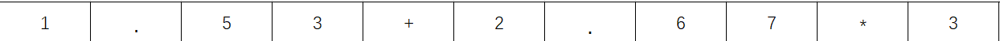

## 引言 

少时，我最讨厌的就是理论课程，我认为我这种菜鸡是不会用到这种底层知识的。长大之后做一个普通CRUD Boy就好了。 但是从之前自己开发 Minecraft 的模组到现在的工作中，我越发感觉到基础知识的重要性。

本人目前工作在面料行业，在业务中，一匹面料的价格由原料的规格参数和工艺成本决定。那么在做类似商城的项目时肯定和标规商品不同。面料在售卖时拥有可定制性，不同工艺情况，不同长度等都会造成单价的不同。所以价格就不会是一成不变的，可能每一笔订单的价格都是不同的。所以就需要有一种解决需要高度可变性的数据构成的方案。在经过了半天的 ~~摸鱼~~ 冥思苦想后，我决定了使用录入价格公式然后通过需求类型来实时计算单价。问题来了，设计一个公式语法很简单，如何解析这个公式并用它计算才是难题。

这正是我决定借助编译原理中的语法分析技术，来构建一个自定义的解析器，从而解决这一问题的原因。接下来，我将分享如何在实际业务中应用这些底层理论，设计出一个适用于面料行业的价格计算系统。

## 什么是语法分析

在深入解析器的设计之前，有必要先了解一下什么是语法分析。语法分析（Syntax Analysis）是编译过程中的一个重要阶段，其主要任务是将源代码组织成结构化的语法树，进而为后续的代码生成和优化提供基础。在编译器中，语法分析器通过处理代码中的语法规则，来验证代码的正确性并生成语法树。


但语法分析并不仅限于编译器的构建，它在很多实际业务场景中也有着广泛的应用，比如配置文件的解析、公式计算、规则引擎等。我的项目就是一个典型的例子：通过语法分析技术，我实现了一个能够解析并计算自定义价格公式的系统。


## 管中窥豹


通过分治的思想，我将目标分为了若干个子目标。

* 解析表达式
  1. 将动态的面料参数换为数字。
  2. 处理加减乘除。
  3. 处理括号。
  4. 处理三元表达式。

## 具体实现


### 处理变量

对于第一点，将动态的面料参数转换为数字，非常明显的采用字符串替换就可以做到。

 ``` kotlin
 val basePrice = "($成本价$ * 1.4) + 10.0" // 将rawExpression 视为基础工艺价格，在此处将$$包裹的字符串是为引用面料基础参数。
 val paintPrice = "(#basePrice# + 10) * 1.3" //为了使用方便，在此处可以使用#包裹来视为引用已有公式
 
 // 采用 正则表达式可以非常方便的替换变量为基础参数值
 var patchedExpression = ""
 
 //处理面料基础参数
 patchedExpression = basePrice.replace("\$([^$]+)\$"){ /* 从数据库读取基础参数 */ }
 patchedExpression = patchedExpression("#([^#]+)#"){ /* 从数据库读取已有表达式 */ }
 ```

​	

### 处理加减乘除


在没有括号存在的前提下，乘法和除法的优先级高于加法和减法。也就是说我们在处理运算符的时候要先考虑乘除法后考虑加减法。在这一步我们就需要开始真正的解析表达式了。表达式是一个字符串，其中包含数字部分、运算符号部分和括号。

***在此处，我们将表达式视作一个字符数组。***



经过简单分析，我们可以获知值是由 **数字** 和 **.** 组成的。  如无错误输入的表达式，这个字符数组中应该只含有

`1~9`，`.`，`+`，`-`，`*`，`/` ，`(` ，`)` 这些符号。

接下来我们用代码来讲述内容。

* 实现一个遍历字符数组的通用方法。

``` kotlin
class Parser(private val expression: String){
    
    private var pos = -1 //游标，标记当前位置。
    private var symbol = '' //暂存当前处理中的字符。
    
    private fun nextChar(){
        pos++ //每次调用都要将游标前进一位
        /**
         * 第一个字符应该是 str[0]所以 pos初始为-1，第一次读取的时候就应该先进行前进游标再读取值，
         * 如果在前进游标后游标数和数组大小相同就说明已经到达了表达式末尾。
         */
        symbol = if(pos < expression.length) expression[pos] else '\u0000'
    }
    
    /**
     * 每一次处理都是一次消耗操作，我们可以通过eat方法来简化处理过程。顺带将空格忽略。
     * 如果想要消耗的字符就是当前读取出来的字符就返回true，否则返回 false
     */
    private fun eat(charToEat: Char): Boolean{
        while(symbol == ' ') nextChar()
        if(symbol == charToEat){
            nextChar()
            return true
        }
        return false
    }
}
```

* 解析过程

具体的解析方法采用了脑海中仅存的递归下降解析法。递归下降解析法在实现中可以拆分为若干个小的方法，每个方法对应一个语法规则中的**非终结符**。

> *所谓的非终结符说白了就是这个符号不可以再被替换成别的符号。例如： “(1+2)” 这个 符号序列可以直接用3替代。*

首先是解析字符串中数字的方法。

```kotlin
private fun parseFactor(): BigDecimal{
    
    if(eat('+')) return ParseFactor() //如果第一个吃到的是+就递归尝试读取后面的数字。
    //如果吃到减号就尝试读取后面的数字并将结果换为负数。
    if(eat('-')) return parseFactor().negate() 
    
    val result: BigDecimal
    val startPos = pos // pos是之前定义的指向当前处理字符位置的下标
    /**
     * 接下来要处理几种情况。
     * 1. 最幸运，开头就是数字。
     * 2. 开头是括号。
     */
    when{  
        
        eat('(') -> {
             //处理括号中的语句。处理完成后还得消耗 ')'
            doSomeThing()
             eat(')')
        }
        
        // 如果当前字符是数字或 ‘.’ 说明这个字符是数字的一部分，我们手动移动游标到下一个字符
        // 循环操作直到当前字符不是数字组成部分，那么从起始位置到现在游标位置的部分就是一个完整
        // 的数字。
        symbol.isDigit() || symbol == '.' -> {
            while(symbol.isDigit() || symbol == '.') nextChar()
            result = BigDecimal(expression.substring(startPos, pos))
        }
        
        else -> throw RuntimeException("Unexpected character: $symbol")
    }
    
    return result
}
```

至此，整个表达式中还有运算符和括号没有被我们处理。 对于一个标准的中缀的数学表达式来讲，一个算式的开头必是数字或者括号，运算符的左右两边是要存在两个值，或者能生成值的表达式。

此处即可以衔接到编译原理的文法分析内容。

* 终结符(V)：终结符是值一个语言的文法无法再将其改变的符号，在此例中可以理解为一个单纯的数字。
* 非终结符(**ε**)：即可以被取代的符号，比如之前举例的(1+2)。
* 开始变量(S)：表示整个句子或者表达式。
* (R)是从V到(V∪**ε**) 的关系，使得 

在教科书中一般将文法写为：G = (V, **ε**，R，S)。其中我们关注点在S上，列：

> S -> T + S | T - S | T
> 
> T -> T * T | T / T | (S) | x | y | z

在上述文法就可以产生我们所需要的算式( x + y ) * x - z * y / ( x + x )。 S可以有T组成，T可以由 T的乘除法，括号内的完整算式S或者数字x，y，z。

我们在之前的代码中从表达式中解析出来了数字，也就是x，y，z。接下来我们来处理T，也就是乘除法。

```kotlin
private fun parseTerm(): BigDecimal{
    var result = parseFactor() // 对于任意一个操作符来讲 都属于 A <操作符> B 这种形式。所以先拿取A
    
    while(true){
        result = when{
            eat('*') -> result * parseFactor() // 消耗掉乘号后肯定是另一个数字，所以直接获取。
            eat('/') -> result.divide(parseFactor(), 2, RoundingMode.HALF_UP)// 同理
            else -> return result
        }
    }
    
}
```

然后是处理加减法。直接上代码。

```kotlin
private fun parseExpression(): BigDecimal{
    val result = parseTerm()  // 1
    
    while(true){
        result = when{   // 2
            eat('+') -> result + parseTerm()
            eat('-') -> result - parseTerm()
            else -> return result
        }
    }
}
```

这个方法的内容很简单，因为乘除法的优先级很高，所以先调用`parseTerm` 来处理乘除法，然后再进行加减法的处理，这个方法就是处理四则运算的完整代码，但是不包括括号。

***三个方法的功能大概为：***

---

- **A方法**

  - 首先调用B方法并将返回值用变量`result`接收。

  - 进入死循环
    - 如果`eat()`拿到了加号就再次调用B方法，并将`result` 与调用B方法的返回值相加。
    - 如果`eat()`拿到了减号就再次调用B方法，并将`result` 与调用B方法的返回值相加。
    - 除此之外，直接返回result为函数返回值。

- **B方法**

  - 首先调用C方法并将返回值用变量`result`接收。
  - 进入死循环
    - 如果`eat()`拿到了乘号就再次调用C方法，并将`result` 与调用C方法的返回值相加。
    - 如果`eat()`拿到了除号就再次调用C方法，并将`result` 与调用C方法的返回值相加。
    - 除此之外，直接返回result为函数返回值。

- **C方法** 

  - 如果`eat()`方法消耗到了加号 就再次调用C方法。
  - 如果`eat()`方法消耗到了减号 就再次调用C方法，并将其结果转为负数。
  - 定义一个储存数字的变量`result`
  - 定义一个临时游标`startPos` 其值等于全局游标`pos`
    - 如果当前游标所指的字符是一个阿拉伯数字或者小数点
      - 进行while循环，如果当前字符是阿拉伯数字或者小数点
        - 将全局游标`pos` 前移。
      - 进入方法时的`startPos`到现在的`pos` 这个下标区间就是一个完整的数字。
  - 返回`result` 

---

现在这个解析器应该可以处理所有不带括号的加减乘除运算了。不过，不能处理括号是根本不能用于实际生产活动的，括号在实际运用中很常见，所以我们需要想办法将括号消除掉。

### 处理括号

首先，回到最基础的四则运算中来。之前提到过，所有的四则运算都是 `A operator B` 的形式，A和B是数字或者能得出数字的一个子表达式，就有如下几种可能性：

- x ± (y ± z)
- x  *| / (y ± z)
- (y ± z) * |/  x

对于我们人类来讲，括号内的算式会被我们优先计算，用括号内的算式的最终值来参与剩下部分的计算。同时括号内可能会出现所有的四则运算，所以我们可以将其看作是一个子表达式，我们可以先将子表达式的结果算出来再进行剩余的表达式计算。且子表达式代表着外层表达式的一个被操作数A 或者 B ，那么我们就能分析出对子表达式的处理应该在处理数字的`parseFactor()` 方法中。 

***改造前面的parseFactor() 方法使其可以处理子表达式为单纯的值。***

```kotlin
private fun parseFactor(): BigDecimal{
    
    if(eat('+')) return ParseFactor() //如果第一个吃到的是+就递归尝试读取后面的数字。
    //如果吃到减号就尝试读取后面的数字并将结果换为负数。
    if(eat('-')) return parseFactor().negate() 
    
    val result: BigDecimal
    val startPos = pos // pos是之前定义的指向当前处理字符位置的下标
    /**
     * 接下来要处理几种情况。
     * 1. 最幸运，开头就是数字。
     * 2. 开头是括号。
     */
    when{  
        
        /************************************************************
         * 在此处我们就先判断，是否存在括号，并将括号内的内容直接视为一个子表达式，处理表达式直接调用 parseExpression() 就行。
         ************************************************************
         */
        eat('(') -> {
             //处理括号中的语句。处理完成后还得消耗 ')'
            parseExpression()
             eat(')') //处理完子表达式后还需要手动将右括号消费掉。
        }
        
        // 如果当前字符是数字或 ‘.’ 说明这个字符是数字的一部分，我们手动移动游标到下一个字符
        // 循环操作直到当前字符不是数字组成部分，那么从起始位置到现在游标位置的部分就是一个完整
        // 的数字。
        symbol.isDigit() || symbol == '.' -> {
            while(symbol.isDigit() || symbol == '.') nextChar()
            result = BigDecimal(expression.substring(startPos, pos))
        }
        
        else -> throw RuntimeException("Unexpected character: $symbol")
    }
    
    return result
}
```


至此，我们的核心功能就已经完成了，目前这个解析器只支持基础四则运算，不过由于我们使用的是递归下降解析，所以我们还可以让这个解析器支持更多的功能。比如三元表达式，if语句等。不过这个解析器的扩展极限在哪里我也不知道，因为我也是管中窥豹，可见一斑。花了少许时间稍微了解了一下这些知识。

### 结语

回顾这段旅程，从最初面对动态定价挑战时的一筹莫展，到如今能够自信地利用编译原理的知识来解决实际问题，这不仅仅是技能上的提升，更是思维方式的一种转变。编译原理的精髓在于它为我们提供了一套工具箱，使得我们可以灵活地应对各种复杂的数据处理需求。

通过这个项目，我也深刻体会到，理论知识并不是空中楼阁，它们是搭建现实世界解决方案的基石。正如我在面料行业中应用语法分析技术一样，我相信每一位开发者都能找到适合自己领域的方法，将这些看似抽象的概念转化为实际的价值。无论你是否觉得自己是个“CRUD Boy”，基础知识的力量总是能在不经意间带来惊喜。

希望我的经历能够激励那些正在探索编程世界的朋友们，不要小觑任何一块砖石，即便是最小的理论知识块，也可能成为你未来成就大厦的重要组成部分。感谢大家的阅读，期待在未来的道路上，我们能够一起探索更多的可能。
