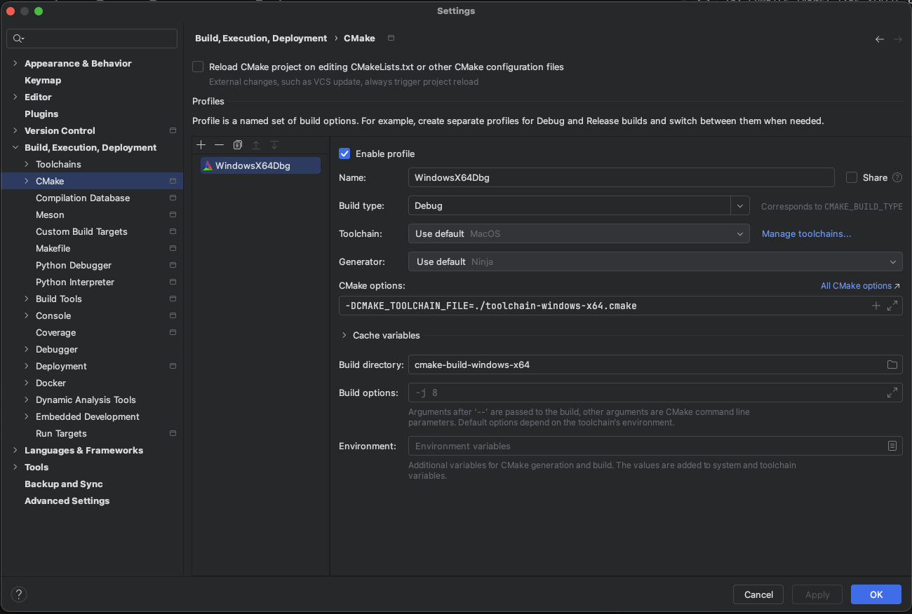

# 引言

自从换了 Apple Mac mini M4，我发现 M 系列芯片和 macOS 系统给我带来的桎梏越来越多。近期，我接到一个任务：为 Windows 设备编写 C++ 程序。这促使我开始探索在 Mac mini 上编译 x64 Windows 可执行文件的方案。经过一番尝试，我发现通过 MinGW 和 CLion 的组合，可以在 M 系列 Mac 上实现高效的交叉编译。本文将分享我的经验，带你一步步完成这一过程，解决跨平台开发的痛点！

# 准备HomeBrew🍺

你可以从 *https://github.com/Homebrew/brew* 找到Homebrew的完整安装教程。

# 安装MinGW

MinGW是(Minimalist GNU for Windows)的缩写。基于 GNU 工具链（GCC），最初由开源社区开发，旨在为 Windows 提供类 Unix 的编译环境。
> brew install mingw-w64

安装过后在`/opt/homebrew/bin`中就会有用于Windows 32/64位编译套件。

# 配置CLion

**CLion不直接支持交叉编译的套件检测，而是通过CMake的toolchain文件来达成交叉编译的目的，所以本方法也可以在VSCode中使用**

## 先创建一个普通的CMake项目
``` cmake
# CMakeLists.txt
cmake_minimum_requried(VERSION 4.0)

project(Demo)
set(CMAKE_CXX_STANDARD 20)
add_executable(Demo src/main.cpp)
```
### 创建工具链描述文件
``` cmake
# toolchain-windows-x64.cmake

# 设置目标系统和架构
set(CMAKE_SYSTEM_NAME Windows)
set(CMAKE_SYSTEM_PROCESSOR x86_64)

# 设置交叉编译器（使用名称，因为已在 PATH；或使用全路径以确保）
set(CMAKE_C_COMPILER x86_64-w64-mingw32-gcc)
set(CMAKE_CXX_COMPILER x86_64-w64-mingw32-g++)
set(CMAKE_RC_COMPILER x86_64-w64-mingw32-windres)  # 用于资源文件，如果需要

# 可选：设置查找根路径（Homebrew MinGW 的头文件和库通常在 /opt/homebrew/x86_64-w64-mingw32）
# 如果你引入了外部库，还需要在下面这行写明目录
set(CMAKE_FIND_ROOT_PATH /opt/homebrew/x86_64-w64-mingw32)

# 配置查找模式，避免主机（macOS）污染
set(CMAKE_FIND_ROOT_PATH_MODE_PROGRAM NEVER)
set(CMAKE_FIND_ROOT_PATH_MODE_LIBRARY ONLY)
set(CMAKE_FIND_ROOT_PATH_MODE_INCLUDE ONLY)
set(CMAKE_FIND_ROOT_PATH_MODE_PACKAGE ONLY)

# 避免 try_compile 时链接问题
set(CMAKE_TRY_COMPILE_TARGET_TYPE STATIC_LIBRARY)

# 一般没有安装过MinGW的PC中没有MinGW的动态链接库，所以要静态链接进去
set(CMAKE_EXE_LINKER_FLAGS "${CMAKE_EXE_LINKER_FLAGS} -static-libgcc -static-libstdc++ -static")
```
## 在 CLion 中配置 CMake Profile

打开 CLion 项目（确保使用 CMakeLists.txt）。
转到 File > Settings（或 Cmd+,） > Build, Execution, Deployment > CMake。
添加新 Profile 或编辑现有：

- Name：如 "Windows x64 Cross"。

- Toolchain：选择 System（主机工具链，用于 CLion 的代码洞察和解析）。
- CMake options：添加 -DCMAKE_TOOLCHAIN_FILE=./toolchain-windows-x64.cmake
- Build directory：设置独立目录，如 cmake-build-windows-x64，避免与主机构建混淆。
- Build type：Release 或 Debug。


点击 Apply，然后 Reload CMake Project（工具栏图标或右键 CMakeLists.txt > Reload CMake Project）。
CLion 会使用 toolchain 文件进行配置和构建。检查 CMake 输出窗口确认使用交叉编译器（应看到 x86_64-w64-mingw32-gcc）。

# 结语

勉强能用